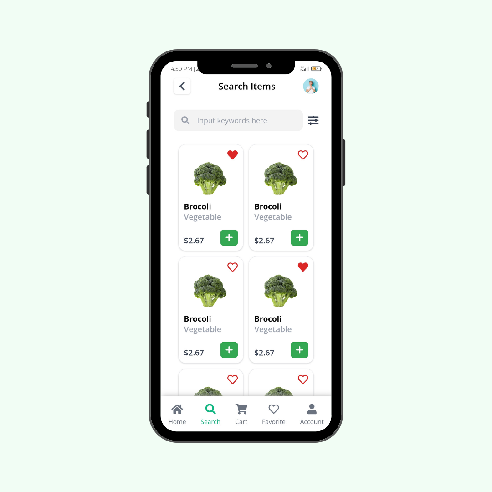

<h3 align="center">Online Shop Farm</h3>

Slicing project #03

### About
This is my projects to make UI using front end tech 

Where the ideas and the concept i use from any other designer UI/UX from Instagram or Dribbble

### Original design
by [Madhu Mia](https://dribbble.com/madhumia)

### Languages and Tools
- Vue Js 3
- Tailwindcss
- Google Font Open Sans
- FontAwesome
- Termux
- Vite Js
- Acode code editor

### Clone This Repo
- <code>git clone https://github.com/or-abdillh/vegetable-app.git </code>
- <code>cd vegetable-app</code>
- <code>npm install</code>
- <code>npm run dev</code>

### Demo 
- [Online Shop Farm](https://online-shop-farm.vercel.app/)
- [Reels Instagram](https://www.instagram.com/reel/CV-YQu6FyZ7/?utm_medium=copy_link)

[Oka R Abdillah ](http://github.com/or-abdillh)
 
Last edited on : 7/1/2021